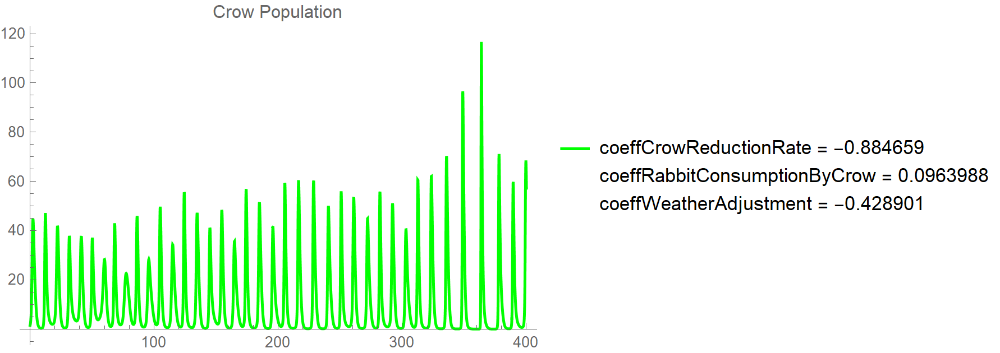
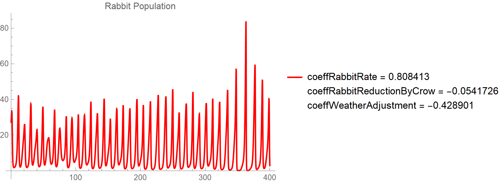

Recently, a friend of mine got me into rabbit videos. For those that don't know, I adore rabbits.
In fact, the adoration goes so far that I wouldn't consciously eat a rabbit.
Aside from that, the [YouTuber][2] my friend presented, uploaded a video where the YouTuber went to a place called [Rabbit Island][3].
Upon watching, I was terribly annoyed by her reaction to the whole place. I think it was a bit dramatic,
but that is just me. However, it got me interested in modeling the population of the rabbits.

Now bear in mind, I barely know much about rabbits. In fact, only recently have I been getting more informed on them
in hopes of owning one in the future. 
In the video, the YouTuber mentioned there were crows acting as predators for the bunnies.
In addition to this there were no dogs or cats allowed on the island.
Perfect. This would be crows vs rabbits. A pretty simple model.

# Setup Modeling

Upon reading some history on Rabbit Island, I learned that it was most likely that eight total rabbits were planted.
There's a bunch of stories on the starting population.
I'm just going to assume a few high schoolers were responsible for this act.

We can start with the basics of the [Lotka-Volterra Model][1].
Crows here are our predators, and rabbits are our prey. As an added bonus: I'm going to include weather into the mix.

$$\frac{dr}{dt}=r(t)[a_1+b_1k(t)+c_1\mathcal{W}(t)]$$

$$\frac{dk}{dt}=k(t)[a_2+b_2r(t)+c_2\mathcal{W}(t)]$$

What exactly are we looking at here? 
Well with the first equation we mean to say the rate at which we have rabbits is affect by
$$a_1$$, or some rabbit rate coefficient,
$$b_1$$, or some rabbit decline coefficient affected by the population of crows at the time,
$$c_1$$, or some rabbit decline coefficient affect by weather at the time.

With the second equation, we will assume that the crows definitely depend on the rabbits to come back to the island.
In other words, we will assume they have no reason to come to the island in the first place.
It is only by word, or caw, or telepathy, or however crows communicate, the crows start coming to the island,
and, in the same manner they will be affected by the weather on the island.
The crows will either be detered or not detered. Likewise,
$$a_2$$ is the crow rate coefficient,
$$b_2$$ is the crow incline coefficient affected by the population of rabbits at the time,
$$c_2$$ is the crow decline coefficient affect by the weather at the time

## Weather is fixed
I've decided that the time will be measured in months. 
I don't know the weather on Rabbit Island, but I will assume it is the same as the weather where I am from:
scorching hot summers/springs, and comfortably freezing winters.
(I exaggerate. I just hate anything above 10 celsius and like literal freezing weather.)
This leads to the conclusion that there are four seasons,
and two of them should really cost against the rabbits (summer and winter).
I've then decided on my weather function.

$$\mathcal{W}(t)=-cos^2(\frac12t)$$

Great. We have our weather function. Now we just need to solve for our growth equations.

I've recently been messing more and more with [WolframAlpha][4] so this will be the tool for this problem.

# Modeling in Mathematica

Let's begin by setting our coefficients first, 
and since we are programming, we might as well give them meaningful names. That will come later.
First let's determine where our coefficients lie. We know $a_1$ should firstly be positive.
However, I really don't want these rabbit population numbers to explode so fast.
We don't want the initial value to be offset more than it shhould.
Recall, the inital value for rabbits, if they just keep growing in population, will look like $c_0e^0$.
We want that initial value to be offset by some small factor I'm guessing.
I will deem $a_1\in\mathcal{I}$ such that $\mathbb{I}\subseteq\mathbb{R^+}$ is the unit interval of $\mathbb{R^+}$.
Now we know what $a_2$ will look like. It is an element of $-\mathbb{I}$.
As for the rabbit decline coefficients, we know it can't be greater than the rabbit incline coefficient.
If that were the case, rabbits population would just plummet. So $b_1<a_1$.
We also know $c_1$ should be in $-\mathbb{I}$ since this will decline rabbit reproduction rate.
For the crow rate, we want $a_2\in-\mathbb{I}$, $b_2<a_1$, and $c_2\in-\mathbb{I}$.


```
coeffRabbitRate=RandomReal[{0,1}];
coeffRabbitReductionByCrow=RandomReal[{-0.1,0}];
coeffCrowReductionRate=RandomReal[{-1,0}];
coeffRabbitConsumptionByCrow=RandomReal[{0,0.1}];
coeffWeatherAdjustment=RandomReal[{0,1}]
weatherAccountability=-Cos[0.5t]^2
```
I ended up making the formula for weather negative and making the weather coefficient positive.

We can now write our rabbit population differential.

```
rabbitRateEqn = 
 r'[t] == 
r[t] (coeffRabbitRate + coeffRabbitReductionByCrow*k[t] + 
     coeffWeatherAdjustment*weatherAccountability[t])
```

For me, this yielded the following equation.
$\frac{dr}{dt} = r(t)[0.804143 - 0.428901 Cos(0.5 t)^2 - 0.0541726 k(t)]$

We'll do the same for the crow population differential.

```
crowRateEqn = 
 k'[t] == k[t] (coeffCrowReductionRate + coeffRabbitConsumptionByCrow*r[t] + 
     coeffWeatherAdjustment*weatherAccountability[t])
```
Which yielded
$\frac{dk}{dt}=k(t) [-0.884659 - 0.428901 cos(0.5 t)^2 + 0.0963988 r(t)]$

As far as my understanding goes, we're not so good at solving these equations. We can only numerically solve them.
There's not really a solution for them in the same way there is a solution for a first-order linear differential.
This is also part of the reason why I chose Wolfram|Alpha for this task too.
I can just do this,

```
solRabbitCrow = NDSolve[
  {rabbitRateEqn, crowRateEqn, r'[0] == 8, k'[0] == 2},
  {r, k}, {t, 0, 400}
]
```
and it spits out my function. It's like the Prime Now of equation solvers.
In fact, it's better than Prime Now, because I don't have to wait two hours for the delivery (at least for this problem).
It's fantastic.

Now we can plot them and see how they go.

```
rabbitPlot = Plot[r[t] /. solRabbitCrow, {t, 20, 400}];
crowPlot = Plot[k[t] /. solRabbitCrow, {t, 20, 400}];
Show[{rabbitPlot, crowPlot}]
crowPlot
rabbitPlot
```

In Mathematica, that /. just means ReplaceAll; linguistically it would be "using solRabbitCrow, replace r[t]".
Generally, it would be "using the object after /. replace everything. before it."

We yield the following graphs. 

{:height='5cm' width='5cm'}


{:height='5cm' width='5cm'}

The horizontal axis is the time in units of months, since that is how I modeled the weather.
The vertical axis is the population at that time.

That's pretty brutal. The weather looks fairly harsh on these guys.
This would explain why birds migrate to warmer areas.
As for the rabbits, I wouldn't expect to see a lot of them during the winter,
but I'm not terribly convinced the population drops that much.
If this is the model we choose, we may need to tweak it so that our weather coefficients don't dramatically hamper rabbit populations.

# Plugs
You are *going* to yield ugly looking rabbits on the island.
Some are going to learn to survive and look safe wihle others are going to look like a meth addict.
It's not at all abnormal.
Anyways, after watching more of this YouTubers videos, I found out she does music. It's actually really good [music][5] too.
At least, I like it. She also does give some pretty good [rabbit care][4] tips,
so if you're thinking about getting a rabbit, or want to learn more about them she's pretty informative.
As always, just cross check statements.

I've left my code on my [git].

[1]: https://en.wikipedia.org/wiki/Lotka%E2%80%93Volterra_equations
[2]: https://youtu.be/mP6LHPIW12M 
[3]: https://en.wikipedia.org/wiki/%C5%8Ckunoshima
[5]: https://www.youtube.com/channel/UCziEEv2DlnaaPYEa4jSqFjw
[4]: https://www.youtube.com/channel/UCUSfEor0VihlL4fMt-VlLgQ
[git]: https://github.com/aferios/
