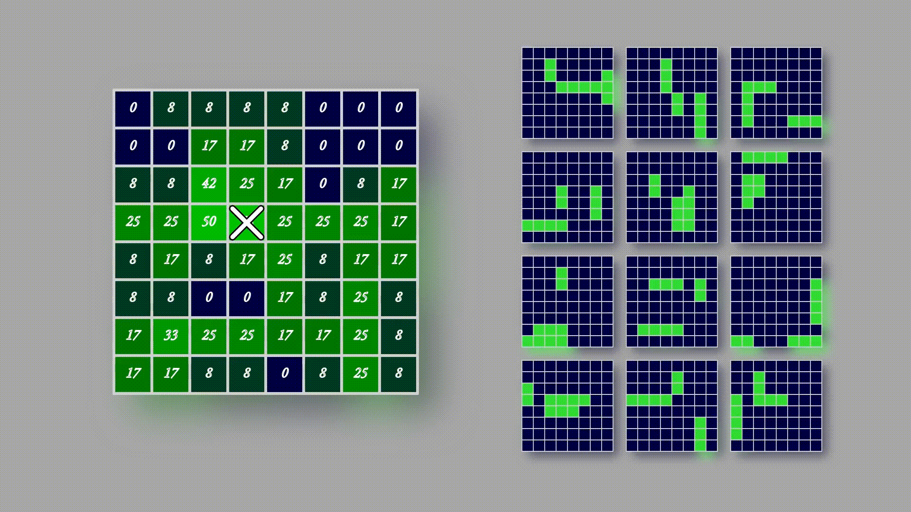
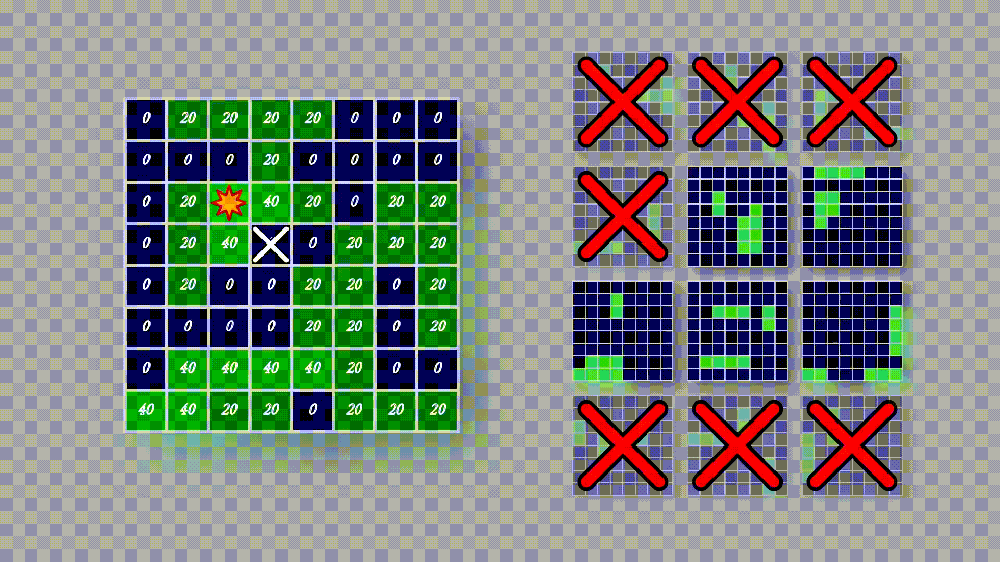

Ocarina of Time speed running brought us arbitrary code execution.
Wind Waker now brings us probability theory.
These are both games in the Legend of Zelda series, and they're great;
I would beat them every single summer up until high school using three heart points max.

Their speed running community is nice, 
and this post is to call attention to the [latest tech from the Wind Waker speed running community.][1]
Unfortunately, I don't have any knowledge whatsoever to fully understand how speed runners managed
to get Ocarina of Time to do arbitrary code execution.

# The Problem
In Wind Waker, there's a dreaded mini-game that is basically single player battleship. 
It's called 'Sploosh Kaboom. You get 24 shots to bring down the squids (the things that replace battleships),
and you get rewards for doing so.
For speed runners trying to 100% clear the game, they must beat it twice.
But the board is randomly generated from a bunch of noise you get on the screen.
There's no way to predict what your board is going to be unless you can compute your board the same way the game does.

## Computing the Board
Let's say you're still not convinved you can't compute the board.
Here is what you have to do to compute the board.
> 1. From the point of you starting the game, to the point you get to play 'Sploosh Kaboom, pay attention to frame 0.
> 2. For every single frame after, remember what was on your screen, what you were doing, who you were interacting with,...
> 3. Calculate a set of random numbers based on the data you just recorded, and some table that tells you what items on your screen correspond to what number.
> 4. Repeat this again for every single frame up to the point you get to play 'Sploosh Kaboom.
> 5. Generate the board from a uniform distribution based on a set of your random numbers that you got up to this point.
Actually, I lied. There wouldn't be a problem if this was every frame.
With a little reverse engineering, if you can find the seed then you can find the board easily.
It's not every frame. It's any single computable moment; a fraction of a frame.
The number of random calls per frame is dependent on what you're looking at, where you are in the game, and also some other noise of interactions.

# Leveraging Givens
The most fortunate thing about Wind Waker's random number generation (RNG) is the seed.
It is seeded with the same three values;
Luckily, the community knows the RNG algorithm, so it's possible to predict the list of numbers that the RNG produces. 
This is a great thing.
There's no need to manipulate RNG. The info is already there. It just needs to be retrieved.
However, there's still the issue of RNG cycles.
The RNG isn't **every** single computable moment. It's **any** single computable moment.
It's possible to redivide everything into frames: 
At frame 0, you will compute $$u$$ random numbers,
at frame 1 you will compute $$v$$ random numbers,
and so on.
It's not the case that $$u=v$$.
All other relevant information is also easy to retrieve. Since boards are easy to retrieve,
and they are generated from the RNG which are already determined, then it is known the baords are ordered.
There is this notion of board $$x$$ comes before board $$y$$.

{:height='5cm'width='5cm'}

Above is an illustration of how the RNG works.

The darker it looks in a region, the more dense the number of RNG calls there are.
Say the list of numbers representative corresponding to a board is

$${0.0605103, 0.167249, 0.663464, 0.951983, 0.0892348, 0.967669, \\ 
0.702174, 0.0392255, 0.81559, 0.759428, 0.6821, 0.518679, 0.576914, \\
0.724361, 0.293933, 0.556898, 0.159694, 0.628431, 0.736384, 0.191526, \\
0.276673, 0.233126, 0.792782, 0.358426, 0.937739, 0.683781, \\
0.0396779, 0.847933, 0.756994, 0.51375, 0.779262, 0.741756, 0.156707, \\
0.0847442, 0.0339166, 0.0984624, 0.539751, 0.767061, 0.241212, \\
0.44031, 0.689301, 0.500813, 0.75327, 0.227607, 0.566945, 0.25014, \\
0.51608, 0.398436, 0.413186, 0.0822243, 0.883059, 0.808693, 0.12936, \\
0.506351, 0.224203, 0.833385, 0.486576, 0.98903, 0.0557798, 0.426649, \\
0.496376, 0.810013, 0.366199, 0.23552, 0.730908, 0.377172, 0.732405, \\
0.800423, 0.00353876, 0.742751, 0.961845, 0.0540908, 0.892944, \\
0.355728, 0.40291, 0.634613, 0.288609, 0.206292, 0.0520766, 0.790476, \\
0.687094, 0.660402, 0.866174, 0.81584, 0.112467, 0.1501, 0.454139, \\
0.459292, 0.135851, 0.248163, 0.102399, 0.992146, 0.433297, \\
0.0897756, 0.588313, 0.216811, 0.658034, 0.379413, 0.612164, 0.867233}$$

For one playthrough, it may be the case only the first four numbers may be called on the first frame.
For a second playthrough, it may be the case only the first seven numbers may be called on the first frame.
What is key here is **every frame uses a variable number of calls**.
This is **not** frame perfect. It is computable moment perfect.

This is all fine and dandy though.

# The Path to 'Sploosh Kaboom
Speedrunners are usually pretty consistent when it comes to their in-game activity.
Unless there's new techniques, everything pretty much stays stagnant to a degree.
You can rely on them to reach a certain point within a given time frame.
Knowing this, it's possible to then count **not the frames**, but the number of RNG steps, the number of computable moments.

Just through data collection, 
the community was able to figure out a speedrunner on record pace encounters 'Sploosh Kaboom at RNG step 5.5 million...
give or take a quarter of a million steps.
If the assumption that each RNG call maps to one specific board holds, 
then predicting which board is yielded the first time is going to be a doozy.

# Simpler Setups
For the sake of explaining the result a bit clearer,
suppose one was more confident of the values yielded.
Say we have a speedrunner sauvant who executes perfectly in a way that the error for reaching 'Sploosh Kaboom
was within 12 RNG steps.

That means, we have only 12 boards to predict from there.
Now it's possible to create a heatmap that shows which squares will most likely yield the highest chance of a successful shot.

Take aim and fire. Looks like we've missed. Now one may say just go to the next one with highest probability.
Here is where Bayes would say no. We now create a new heatmap that calculates probabilities based upon newfound knowledge.
The question we answer now is, what is the probability each square is a hit, given that one square was a miss.

Consequently, we eliminate all boards contaiing our missed square and make a new heatmap.

Take aim and fire. Looks like we've succeeded! 
Following Bayes once more, we calculate a new heatmap that calculates the probability each square is a hit given that one square was a hit.

Repeat. Repeat. Repeat. We now yield the one true board.

# Finding the Simple Setup
Unfortunately, there exists no speed runner with such accuracy. 
However, speed runners have found a way to "choke" their accuracy, 
by which I mean they yield even more confident intervals; 
y'know, something better than give or take a quarter of a million.

Fortunately, the game reveals the board you had when you fail.
Remember how there is a mapping from the randombly generated number to the board?
There's a map the other way around.
It's possible to know the randomly generated number you got from the board.
To frame this in context,
**it's possible to know where you are in the sequence of the "RNG".**

## Applying More Probability Theory
Let's say you're a speed runner. You reach the dreaded mini-game,
try your hand at it, fail, and end up with the following board.

As it turns out, there are a few spots where you can be, say four. Call them spots $$a_1, a_2, a_3, a_4$$.
Let's set a framework first: $$a_i<a_j$$ if and only if $$i<j$$.
Now we can ask for the distance between your set of selected spots and the step in spot 5.5 million.
The randomly generated number in step 5.5 million, we don't really care about all that much.
What we care about is the number of steps between that number and your possible spots.
As it turns out, it's case that $$a_3$$ is closest to step 5.5 million. 
Next is $$a_2$$, and $$a_1$$ and $$a_4$$ are really far from step 5.5 million.
We can put this in the language of probabilities.
If we assume speed runners are more likely to hit the 5.5 million step when they reach 'Sploosh Kaboom,
and the farther away a step is from 5.5 million the less likely a speed runner is to hit that step,
then that is just a Gaussian curve.

We can describe these spots, not just in distanes, but in the language of probability.
Speed runner Joe here landed in such a way that we really only care about two points: $$a_2, a_3$$; 
relabel as $$a_1, a_2$$, respectively.

Say you are 65% likely to land at step $$a_2$$ and 35% likely to land on step $$a_1$$.
Focus on just one for now. 

If it is indeed the case you landed on step $$a_1$$,
then you know the set of maps you are going to be dealt.
The time between first and second board generation is fixed,
so based on that RNG step distance, you can calulate a new Gaussian,
with insanely small variance,
that will yield the set of possible boards you will be dealt.

We can also do this for step $$a_2$$.

With these two sets of boards, our heatmap looks healthy; it looks like the heatmaps in the simpler setup.
For comparison, here is what it would look like if we just sampled the quarter of a million possibilities.

Once the board is solved, we're golden. We know where our RNG step is (given that we were prreviously at step $$a_1$$ or $$a_2$$,
and we can compute the possible set of boards in the next game--recall, speedrunners need to beat it twice.

# About the Solution
One of the really nice things about having this kind of setup,
one that is "manual" in a sense,
is its ability to scale.
The method can be applied to various versions of Wind Waker and it will still work.
There's no silly business under the hood with memory addresses, RNG manipulation, or other hackerman cheats.
As long as the seed is knows and the sequence of random numbers, it is prime for success.

# Credits	
[Shout outs to the NSA for inadvertently helping out the community.][2]
Huge thanks to [Linkus][3] for posting a video about the method.
Huge thanks to [Peter][4] for developing the tool and the animations used above.

[1]: https://youtu.be/1hs451PfFzQ
[2]: https://ghidra-sre.org/
[3]: https://www.twitch.tv/linkus7/
[4]: https://github.com/petersn/web-sploosh-kaboom
